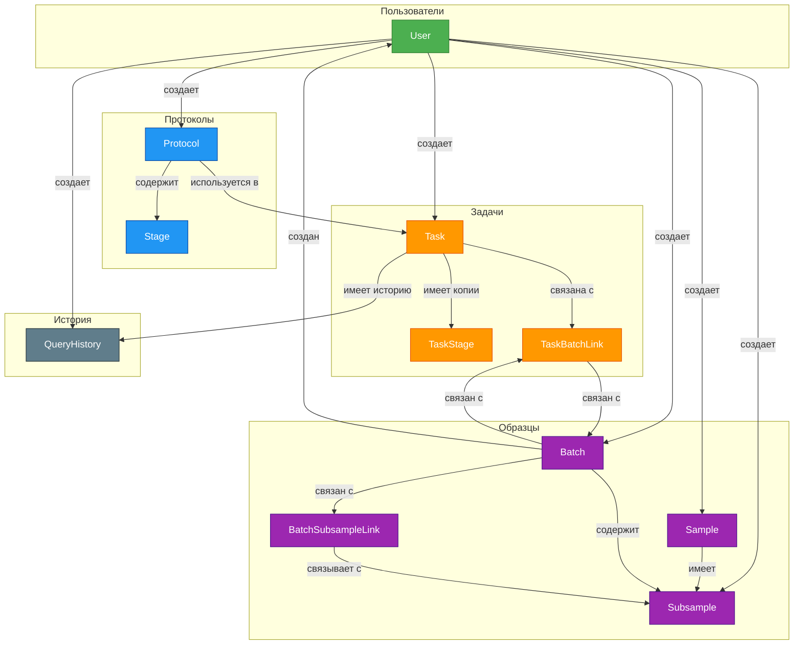

# PhilsLab

Project repository.

```mermaid
graph TB
    subgraph "Пользователи"
        User[User]
    end

    subgraph "Протоколы"
        Protocol[Protocol]
        Stage[Stage]
    end

    subgraph "Задачи"
        Task[Task]
        TaskStage[TaskStage]
        TaskBatchLink[TaskBatchLink]
    end

    subgraph "Образцы"
        Sample[Sample]
        Subsample[Subsample]
        Batch[Batch]
        BatchSubsampleLink[BatchSubsampleLink]
    end

    subgraph "История"
        QueryHistory[QueryHistory]
    end

    User -->|создает| Protocol
    User -->|создает| Task
    User -->|создает| Batch
    User -->|создает| Sample
    User -->|создает| Subsample
    User -->|создает| QueryHistory
    
    Protocol -->|содержит| Stage
    Protocol -->|используется в| Task
    
    Task -->|имеет копии| TaskStage
    Task -->|связана с| TaskBatchLink
    TaskBatchLink -->|связан с| Batch
    Task -->|имеет историю| QueryHistory
    
    Sample -->|имеет| Subsample
    
    Batch -->|содержит| Subsample
    Batch -->|связан с| BatchSubsampleLink
    BatchSubsampleLink -->|связывает с| Subsample
    
    Batch -->|связан с| TaskBatchLink
    Batch -->|создан| User

    style User fill:#4CAF50,stroke:#2E7D32,color:#fff
    style Protocol fill:#2196F3,stroke:#0D47A1,color:#fff
    style Stage fill:#2196F3,stroke:#0D47A1,color:#fff
    style Task fill:#FF9800,stroke:#E65100,color:#fff
    style TaskStage fill:#FF9800,stroke:#E65100,color:#fff
    style TaskBatchLink fill:#FF9800,stroke:#E65100,color:#fff
    style Sample fill:#9C27B0,stroke:#4A148C,color:#fff
    style Subsample fill:#9C27B0,stroke:#4A148C,color:#fff
    style Batch fill:#9C27B0,stroke:#4A148C,color:#fff
    style BatchSubsampleLink fill:#9C27B0,stroke:#4A148C,color:#fff
    style QueryHistory fill:#607D8B,stroke:#263238,color:#fff
```
